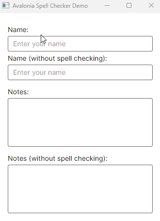

# Avalonia Spell Checker for TextBox


Avalonia Spell Checker adds real-time spell-checking to Avalonia TextBox controls without replacing or changing their behavior. It uses the WeCantSpell.Hunspell library for spell-checking and allows you to manage custom dictionaries. The extension integrates with existing TextBox elements and provides suggestions for misspelled words through a context menu.


<p float="left">
   



</p>

## Features

- **Real-time Spell Checking**: Misspelled words are highlighted as the user types.
- **Custom Dictionaries**: Add (or manage WIP) custom words for specific languages. 
- **Context Menu Integration**: Provides suggestions for misspelled words in a context menu.
- **Customization**: Developers can modify styles for underlining and other text decorations for incorrect words.
- **Works with native Avalonia TextBox**: The library is minimally intrusive, integrating seamlessly with text control.
- **Support for Multiple Languages**: Allows the use of different language dictionaries simultaneously.


## Getting Started

### Prerequisites

- [.NET 6 or higher](https://dotnet.microsoft.com/download) < Needs to be confirmed
- [AvaloniaUI](https://avaloniaui.net/)
- [WeCantSpell.Hunspell](https://github.com/WeCantSpell/Hunspell)

### Installation


1. Clone this repository (there is also a Nuget package):
   ```bash
   git clone https://github.com/GustavoHennig/Avalonia.SpellChecker.git
   ```

2. Install the required packages:
   ```bash
   dotnet restore
   ```

3. Ensure the dictionary files (.aff and .dic) are placed in the `Dictionaries` folder, as specified in `SpellCheckerConfig`.

### Usage

To enable spell checking for a `TextBox` control, initialize `TextBoxSpellChecker` with the required configuration:


```csharp
public partial class MainWindow : Window
{
    private readonly TextBoxSpellChecker textBoxSpellChecker;

    public MainWindow()
    {
        InitializeComponent();

        // Initialize the spell checker
        // * default dictionaries directory is Path.Combine(Path.GetDirectoryName(Assembly.GetExecutingAssembly().Location), "Dictionaries"))
        textBoxSpellChecker = new TextBoxSpellChecker(SpellCheckerConfig.Create("pt_BR", "en_GB"));

        var textBox = this.FindControl<TextBox>("tbDescription");
        textBoxSpellChecker.Initialize(textBox);
    }
}
```

The `TextBoxSpellChecker` automatically begins spell-checking the `TextBox` control. Misspelled words are underlined, and suggestions are provided in a context menu when the user right-clicks on the word.   
When the `TextBox` control is detached from the view, the spell checker automatically removes its event handlers, and the reference to the `TextBox` is cleared.


## Dictionary Files


According to ChatGPT, these are the most reliable and updated sources for downloading Hunspell dictionary files (ok, it seems that the first one is the easiest choice):


1. **LibreOffice Dictionaries Repository**:
   The LibreOffice project maintains updated Hunspell dictionaries for a variety of languages. You can find them here:
   - [LibreOffice Dictionaries on GitHub](https://github.com/LibreOffice/dictionaries)
   
   This is one of the best places to find dictionaries that are actively maintained and used by large communities.

2. **Mozilla Add-ons**:
   Mozilla also uses Hunspell dictionaries for spell checking in Firefox, and they maintain a large collection of dictionaries available for download:
   - [Mozilla Add-ons: Dictionaries](https://addons.mozilla.org/en-US/firefox/language-tools/)

3. **Apache OpenOffice**:
   OpenOffice also provides Hunspell-compatible dictionaries that you can download:
   - [Apache OpenOffice Dictionaries](https://extensions.openoffice.org/en/search?f%5B0%5D=field_project_tags%3A157)

4. **Hunspell Dictionaries Collection**:
   ~~The Hunspell project itself hosts a repository of dictionaries:~~
   ~~- [Hunspell Dictionaries on GitHub](https://github.com/hunspell/hunspell/tree/master/dictionaries)~~ 404

These sources are widely trusted and offer dictionaries that are kept up-to-date by large communities and projects.


## Known Issues


- Works only with Fluent theme
- Keyboard context menu is not showing the suggestions
- Only tested on Windows


## Customization

You can customize the behavior and appearance of the spell checker by modifying:

- **Text Styles**: Define how misspelled words are underlined or styled in `SpellCheckerTextPresenter.cs`. (WIP)
- **Custom Dictionaries**: Add or remove custom words for specific languages through `DictionaryManager.cs`.

## TODO

- [X] Implement custom word management (add/remove custom words).
- [ ] Allow dynamic enabling/disabling of spell checking.
- [ ] Improve performance for larger text inputs.
- [X] Include dictionary files for multiple languages.

## Contributing

Feel free to contribute by submitting pull requests, reporting issues, or suggesting features.

## License

This project is licensed under the MIT License.
